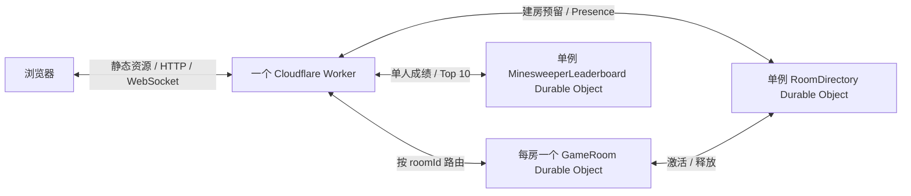

# ym0v0 棋类对战平台：≤10 人极简方案

方案日期：2026-08-19  
当前执行基线：邀请房 MVP（2026-08-20 已扩展）

> 本文保留最初五子棋/象棋 MVP 的调研与架构背景。2026-08-20 后的权威统一语言以 [`CONTEXT.md`](../CONTEXT.md) 为准；下文已同步规则投影与并发协议，仍以“五子棋”为例的目录和交互描述只代表该 renderer，不再限制其他棋种。

## 1. 一句话结论

将 `https://play.ym0v0.com` 部署为一个 Cloudflare Worker：它同时提供前端静态资源、少量 HTTP API 和 WebSocket；每个房间对应一个 SQLite-backed `GameRoom` Durable Object；单例 `RoomDirectory` 管理房间容量和 Presence；单例 SQLite-backed `MinesweeperLeaderboard` 按难度保存单人扫雷最佳成绩。除此之外不启用其他 Cloudflare 数据服务。



平台不设置在线游客人数闸门，但全站同时最多存在 10 个尚未废弃的 Room。单例 `RoomDirectory` 先原子创建 60 秒 provisional lease，GameRoom 持久化后再把它激活。明确的初始化失败会立即回滚；若只是返回途中断导致提交结果未知，Worker 会使用同一租约幂等重试，并保留临时占位而不误释放已提交房间。GameRoom 废弃前先持久化释放任务，失败由 alarm 重试；旧版本房间首次唤醒时也必须先登记容量才能继续服务。首页及其他页面每 10 秒续期一个按 Guest 去重的 45 秒 Presence，并从同一次 RPC 取得在线人数和已激活房间数；心跳与 leave 使用单调序号和 5 分钟近期 tombstone 抵抗乱序。首次无 Cookie 的并发标签页通过 IndexedDB 原子共享一个 60 秒随机 bootstrap，`RoomDirectory` 只在该短租约内将它兑换为同一 Guest，浏览器与服务端都会按期淘汰；Web Lock 只用于避免重复请求。

## 2. MVP 做什么

- 首页保留五子棋、中国象棋、井字棋、扫雷四个入口；扫雷点击后再选单人/双人竞速和难度。昵称设置后收起为右上角 Chip。
- 前两个不同身份占据两个席位；第三位及之后的游客作为只读观众实时接收完整局面。
- `15×15` 自由五子棋：黑先，横竖斜连续 `>=5` 获胜，无禁手，满盘和棋。
- 休闲中国象棋：红先，支持九宫/河界、所有基础棋子走法、飞将、将死、困毙、三次重复与连续 60 回合无进展自动和棋；暂不实现竞赛规则的长将/长捉责任裁定。
- 经典 `3×3` 井字棋：X 先，三连获胜，支持观战和复赛换先。
- 单人扫雷：三种标准难度、延迟布雷与首点 3×3 保护；按难度记录签名 Guest 的个人最佳和全站 Top 10。
- 双人扫雷竞速：同一权威雷区与共同中央安全起点，双方使用独立 revealed/flags，只公开进度，先完成获胜，踩雷失败。
- 服务端权威校验落子、回合、胜负；支持认输和双方确认后再来一局。
- 刷新、短暂断网、Worker/DO 休眠后自动重连并恢复完整局面。
- 手机优先棋盘、落点预览、最近一手、胜利连线、连接状态和明确错误提示。

明确延后：账号、D1、永久棋谱、回放、排位、Elo、赛季、快速匹配、棋钟、AI、聊天、举报、管理后台、PWA、KV、R2、Queues 和支付。当前单人扫雷榜为匿名休闲榜，不具备完整服务端回放校验，不宣称强反作弊。

## 3. GitHub 调研后的选择

完整证据、活跃度和许可证快照见 [GitHub survey](./research/GITHUB_SURVEY.md)。

| 候选 | 借鉴内容 | 当前决定 |
| --- | --- | --- |
| `cloudflare/templates` | 官方 Worker 脚手架 | 作为起点 |
| `cloudflare/workers-chat-demo` | 每房一个 DO、WebSocket Hibernation、广播 | 作为最接近的服务端参考 |
| `cloudflare/partykit` | 重连和房间生命周期封装 | ≤10 人 MVP 不引入；原生 API 更少依赖 |
| `hulang1024/online-chess` | 五子棋/象棋房间的产品功能 | Java + MySQL + Redis 栈过重，只看产品交互 |
| `boardgame.io` / Colyseus / Nakama | 通用多人游戏能力 | 都要求更多运行时或平台，远超本项目需要 |
| GitHub 上的五子棋项目 | UI、AI、规则测试思路 | 多数无许可证、非权威服务端或技术栈不匹配，不 fork |

结论是：基于 Cloudflare 官方原语独立实现约几百行的房间与规则核心，比改造一个完整开源平台更小、更安全。

## 4. 最小技术栈与目录

- TypeScript + Preact + Vite：小型前端，不引入 UI 组件库。
- 原生 Cloudflare Worker 路由：提供会话、平台统计、建房、房间连接与扫雷榜接口，不引入 Hono。
- 原生 Durable Objects WebSocket Hibernation API：不引入 PartyServer。
- `GameRoom` 通过 DO Storage 的对象 `get/put` 保存 `room` 状态，不直接写 SQL；`MinesweeperLeaderboard` 则使用自己的 SQLite 表与唯一键，以便原子更新个人最佳并按用时排序 Top 10。
- Vitest 做纯规则单测；Cloudflare Workers 测试工具做 DO 集成测试；Playwright 做双浏览器 E2E。
- 单一 `package.json`、单一 Wrangler 项目，不做 monorepo。

```text
src/
├─ worker.ts                    # 静态资源、会话、建房、WS 路由
├─ game-room.ts                 # Durable Object、席位、持久化、广播
├─ minesweeper-leaderboard.ts   # 单例 SQLite DO、个人最佳与 Top 10
├─ core/
│  └─ game-rules.ts             # 唯一棋类规则接口
├─ games/
│  ├─ gomoku/
│  │  ├─ rules.ts
│  │  └─ rules.test.ts
│  ├─ xiangqi/
│  │  ├─ rules.ts
│  │  └─ rules.test.ts
│  └─ minesweeper/              # 共享引擎、单人控制器、duel 兼容与 race 规则
├─ shared/
│  └─ protocol.ts
└─ web/
   ├─ App.tsx
   └─ games/
      ├─ gomoku/Board.tsx
      ├─ xiangqi/Board.tsx
      └─ minesweeper/           # 共享棋盘、单人页、竞速 renderer、榜单客户端
```

## 5. 棋类扩展缝

平台只认识房间、连接、匿名身份、席位、`revision`、持久化和广播；棋类模块负责初始局面、轮次、动作合法性、局面变化、规则终局和公开投影。接口保持三个同步纯方法：

```ts
interface GameRules {
  readonly definition: {
    gameType: string;
    ruleSetId: string; // 例如 gomoku.freestyle15.v1 / xiangqi.casual.v1
    actionConsistency: "strict_revision" | "concurrent_idempotent";
  };
  create(seats: readonly [SeatId, SeatId], context: RuleContext): RulePosition;
  apply(
    current: RulePosition,
    command: { seat: SeatId; payload: JsonValue },
    context: RuleContext,
  ): { ok: true; next: RulePosition } | { ok: false; code: string };
  project(position: RulePosition, viewerSeat: SeatId | null): RulePosition;
}

interface RulePosition {
  data: JsonValue; // 只有对应棋类模块和前端 renderer 理解
  turn: SeatId | null;
  outcome: { kind: "win"; winner: SeatId; reason: string }
    | { kind: "draw"; reason: string }
    | null;
}
```

约束同样属于接口：`create/apply/project` 必须对相同输入与 `RuleContext` 产生相同结果、无 I/O、不修改输入；时间和随机种子只能由平台显式注入。所有状态可 JSON 序列化；规则升级发布新的不可变 `ruleSetId`。平台绝不读取 `position.data.board` 或雷区内容，也不出现棋种专用判断。

前端按 `ruleSetId` 从 adapter Map 选择棋盘，再用 `gameType` 做一致性校验；首页的普通双人棋类入口由已注册 adapter 自动投影，扫雷因需先选单人/双人竞速与难度而保留一个聚合入口。以后增加普通棋类只需新增对应规则、测试和 renderer，再在规则 Map 与 adapter 列表各注册一次；具有多玩法选择层的游戏还需增加自己的聚合入口。Worker、GameRoom、席位和重连核心无需按棋种名称改变。

不提前设计通用棋盘、棋子、坐标、吃子或将军接口。当前接口承诺两席位、确定性规则，并通过 `project` 同时支持完全信息与隐藏信息游戏。

## 6. 房间、身份与协议

1. 页面启动先调用 `POST /api/session` 并提交规范化显示昵称。Worker 验证并复用已有匿名身份，把昵称与游客 ID 一起写入 HMAC 签名 Cookie；仅在缺失或签名无效时生成高熵匿名 ID。Cookie 设置 `Secure; HttpOnly; SameSite=Lax; Max-Age=2592000`，30 天有效期覆盖房间保留期。
2. `POST /api/rooms` 生成至少 96 bit 随机 `roomId`，并在 `GameRoom` 初始化时原子地把创建者身份绑定到 Seat A，再返回 `/r/:roomId` 邀请链接。身份或席位令牌不放进 URL。
3. `GET /api/rooms/:roomId/websocket` 检查同源 `Origin` 和 Cookie，再把升级请求转发到对应 DO。
4. 创建者固定为 Seat A；邀请链接只允许第一个不同的匿名身份占 Seat B，之后的不同身份以 Spectator 身份进入。相同身份刷新或多标签页仍回到原席位或观众身份。

协议使用小型 JSON，不需要二进制：

```json
{
  "v": 1,
  "type": "game_action",
  "gameType": "gomoku",
  "ruleSetId": "gomoku.freestyle15.v1",
  "expectedRevision": 12,
  "payload": { "type": "place", "x": 7, "y": 7 }
}
```

服务端返回 `snapshot`，包含 `gameType`、`ruleSetId`、`actionConsistency`、最新 `revision`、自己的席位、双方状态和面向该观看者投影后的 `RulePosition`。认输和准备复赛是平台命令；复赛必须双方确认，并交换先后手。权威局面只保存在 Durable Object，隐藏雷区、种子和对手旗帜不会进入终局前的浏览器快照。

客户端 envelope 中的 `gameType/ruleSetId` 只用于版本一致性检查；服务端始终使用房间初始化时持久化的不可变 `ruleSetId` 选择规则模块，不一致立即拒绝，绝不按客户端字段切换规则。

每个改变持久状态的命令令 `revision + 1`。DO 逐条执行：校验消息 → 校验身份、规则 ID 与一致性策略 → 调用房间已绑定的规则模块 → `storage.put("room", nextState)` → 广播观看者专属 snapshot。必须先持久化再广播。五子棋、象棋和井字棋继续严格拒绝旧 revision；扫雷竞速携带 `actionId + clientSeq + baseRevision`，允许基于旧 revision 的不同格动作按服务端收到顺序依次生效，并用有限 receipt 缓存幂等去重。

五子棋完整快照通常只有几 KB；当前小规模房间中，全量同步比 delta、事件日志、补包和命令去重缓存更简单可靠。客户端断线后指数退避重连，离线时禁用操作，重连以服务端 snapshot 覆盖本地状态。

DO 使用 WebSocket attachment 保存身份和席位，使 Hibernation 唤醒后可恢复连接上下文。一个简单 alarm 清理过期房间：等待房 1 小时无活动、结束房 24 小时、进行中房 7 天无活动；到期前若有新活动则重新安排。

## 7. 棋种实现

### 五子棋

棋盘用长度 225 的数组，值为 `empty/black/white`。`apply` 只接受 `{type:"place", x, y}`，依次验证局未结束、行动席位、坐标范围和空位；落子后只沿横、竖、两条斜线从最新落点向两边计数，复杂度为 `O(15)`，不需要 WASM、位棋盘或 AI 引擎。

必须覆盖的规则测试：四个方向、边角落子、五连与长连、占位、越界、非当前席位、终局后落子和满盘和棋。规则函数在浏览器中只用于落点提示，最终裁决始终来自服务端。

### 中国象棋

中国象棋使用 9×10 交叉点数组；首局 Seat A 为红方先行、Seat B 为黑方，复赛继续沿用平台的先后手交换机制。`apply` 验证将/帅、士、象/相、马、车、炮、兵/卒的基础走法、宫界、河界、炮架、蹩马腿、塞象眼、飞将和自将。对手没有合法着法时，根据是否被将判定将死或困毙；同一完整局面（棋盘加行动方）第三次出现时自动判和。为限制快照与存储增长，吃子或兵卒向前移动会重置重复历史；连续 120 个半回合（60 个完整回合）没有吃子或兵卒前进时自动判和，因此重复表最多保留 121 项。前端 renderer 只负责选择和预览，最终裁决仍来自服务端。

### 扫雷

单人与双人复用确定性的 `MinefieldEngine` 和同一套 `MinesweeperBoard`。新建双人房绑定 `minesweeper.race.*.v1`：服务端只生成一张雷区，双方从共同中央安全区开始，各自独立保存揭格和旗帜；公开投影只向玩家发送自己的格子，并向所有观看者发送双方进度。旧 `minesweeper.duel.*.v1` 继续注册以兼容既有房间，但首页不再创建。单人成绩按难度写入 `MinesweeperLeaderboard`，每个签名 Guest 只保留最快一条并返回全站 Top 10。

## 8. 性能与体验

- 静态资源、API 和 WebSocket 同源，减少 DNS/TLS、CORS 和 Cookie 问题。
- 首屏 JS gzip 目标 `<100 KB`，硬上限 `150 KB`；不用第三方字体、广告、统计脚本和大型组件库。
- 交叉点棋盘使用 Canvas 2D，按设备像素比绘制但 DPR 上限为 2；井字棋和扫雷使用语义化 DOM Grid。
- 手机棋盘占满可用宽度；桌面大扫雷地图在可用列宽内缩放并完整渲染，不需要横向拖动，窄屏手机保留自身 viewport 内拖动/缩放且不造成页面横向溢出。严格棋类确认前不画实子，双人扫雷按格显示 pending。
- 所有棋盘提供可访问名称与文本状态；桌面扫雷支持右键插旗，手机支持长按插旗。
- 正常落子只执行一次 GameRoom 小对象写入和一次房间广播，不跨 DO 续租；`RoomDirectory` 另行处理建房、旧房登记、废弃释放和 Presence 心跳；`MinesweeperLeaderboard` 只在打开单人页或完成单人局时访问。DO 路由均使用 `locationHint: "apac"`。
- 目标：规则计算 `<1 ms`；同区域落子确认 p95 `<200 ms`；重连恢复 p95 `<1 s`。大陆网络延迟主要受运营商到 Cloudflare 的链路影响，必须用移动、联通、电信实测，普通全球网络不能承诺稳定低延迟。

## 9. 最小安全基线

- 仅接受 `https://play.ym0v0.com` 和明确预览域的 WebSocket Origin。
- 单条客户端消息最多 4 KB；运行时校验消息结构、字符串长度、坐标和枚举值。
- 每连接令牌桶限制约 10 条命令/秒、突发 20；房间创建按匿名身份和 IP 粗限速。
- 同一 Guest 每房最多 4 条 WebSocket/HTTPS 连接，单房最多 16 条；观众最多占 8 条，不能挤占玩家入座或重连容量。离线观众的昵称会从房间存储中清理。
- 房间 ID 至少 96 bit 随机；会话 Cookie、签名和内部异常不写日志、不放 URL。
- 会话 Cookie 使用 `Secure + HttpOnly + SameSite=Lax`；脚本可读的 IndexedDB bootstrap 只用于 60 秒首次并发去重，过期后既会轮换，也不能重新签发先前 Guest 的 Cookie。
- 每位游客有显示昵称；统一做 Unicode/空白规范化，拒绝控制字符并限制为 1–16 个 Unicode code point。昵称只渲染为文本，不解析 HTML，也不作为身份凭据。
- 设置 CSP、`X-Content-Type-Options: nosniff`、`Referrer-Policy: same-origin`。不做自由文本聊天，避免首版引入审核面。

匿名休闲局不能提供强反作弊或身份追责；这正是排位和账号延后的原因。

## 10. 部署到 play.ym0v0.com

公开 DNS 已确认 `ym0v0.com` 使用 Cloudflare nameserver，`play.ym0v0.com` 当前未占用。

1. 使用 `create-cloudflare` 生成 TypeScript Worker 项目，加入 Preact/Vite，配置 Static Assets。
2. 在 `wrangler.jsonc` 中绑定一个 `ROOMS` Durable Object 类，并通过当前 Wrangler 的 declarative `exports.GameRoom.storage: "sqlite"` 声明 SQLite-backed DO；不混用旧 migration 配置。
3. 通过 `wrangler secret put SESSION_SECRET` 写入随机会话签名密钥，不提交到 Git。
4. 本地运行规则、DO 集成和双浏览器测试，再执行 `wrangler deploy`。
5. 在 Wrangler 配置或 Cloudflare Dashboard 为 Worker 添加 Custom Domain `play.ym0v0.com`；Cloudflare 自动创建 DNS 记录和证书。
6. 用桌面浏览器、两部手机和三家大陆运营商完成冒烟测试；确认建房、双人加入、落子、认输、复赛、刷新及断网恢复。
7. 记录可回滚的 Worker 版本；上线失败时回滚代码，已有 DO 状态仍采用同一 `schemaVersion` 读取。

开发和预览环境使用不同 DO namespace，避免测试连接进入生产房间。首版状态结构只增不删；真正需要破坏性迁移时发布新 DO 类或加入显式状态迁移。

## 11. 测试与上线门槛

- 纯规则单测覆盖全部合法性和胜负边界。
- DO 集成测试覆盖严格棋类旧 revision、扫雷并发旧 revision、重复 `actionId`、私有投影、伪造席位、错误 payload、存储后广播和休眠恢复。
- 排行榜测试覆盖分难度个人最佳、严格更快更新、稳定 Top 10、签名昵称、输入边界和持久化重启。
- Playwright 使用两个独立浏览器 context 完成整局，并覆盖刷新、断网和 360 px 手机视口。
- 容量测试并发创建 11 个房间时必须严格得到 10 个成功与 1 个容量拒绝；同时覆盖初始化幂等重试、提交结果未知、旧房登记、租约防 ABA 与废弃释放重试。
- 生产只记录错误、房间生命周期、重连次数和 ACK 延迟，不记录 Cookie、昵称或完整棋谱。
- 告警关注 Worker/DO 错误率、请求额度和 p95 ACK；错误率持续超过 1% 或 p95 超过 500 ms 时调查。

## 12. 成本和扩展路径

在 10 人规模下，Static Assets、Worker 和 SQLite-backed Durable Objects 通常可落在 Cloudflare Free 配额，已有域名之外预计增量约 `$0/月`。免费额度可能硬性截断，发布前以账户控制台的当期额度为准并设置用量告警；开始公开推广或接近额度时升级 Workers Paid，常见最低档约 `$5/月`。

| 真实需求出现时 | 只增加这一项 |
| --- | --- |
| 100+ 人或更多房间 | 实时架构不变；每房 DO 已天然分片 |
| 随机匹配 | 一个 MatchQueue DO |
| 账号、跨设备历史、跨游戏正式排行榜 | D1 |
| 赛后异步结算或通知 | Queue |
| 大量永久棋谱/导出 | R2，D1 只存索引 |
| 单房大量观众 | SpectatorRelay DO |
| 更多棋类 | 新规则模块 + 新 renderer，不改基础设施 |

不要因为“以后可能需要”提前启用服务；每项都有清晰触发条件。

## 13. 排期与交付验收

- 第 1 天：单项目脚手架、规则接口、五子棋规则和测试、DO 状态读写。
- 第 2–4 天：匿名会话、邀请房、WebSocket 权威落子、完整 snapshot 重连、移动端棋盘。
- 第 5–7 天：认输/复赛、安全限制、E2E、容量测试、域名部署和运营商实测。
- 一名熟悉 TypeScript 的开发者约 4–7 天可交付基础 MVP；中国象棋已通过既有扩展缝作为第二棋种接入。

验收结果必须是：两个新浏览器只凭邀请链接能完成一局；任何并发、刷新、休眠或短暂断网都不会产生双落子或丢失已确认局面；扫雷竞速双方只看到自己的独立棋盘且产生唯一终局；单人榜返回个人最佳和 Top 10；360 px 手机可准确操作；新增棋类时不修改 GameRoom 核心。

## 14. 主要官方资料

- [Workers Static Assets](https://developers.cloudflare.com/workers/static-assets/)
- [Workers Custom Domains](https://developers.cloudflare.com/workers/configuration/routing/custom-domains/)
- [Durable Objects](https://developers.cloudflare.com/durable-objects/)
- [Durable Objects WebSocket Hibernation](https://developers.cloudflare.com/durable-objects/best-practices/websockets/)
- [Durable Objects Storage](https://developers.cloudflare.com/durable-objects/api/storage-api/)
- [Durable Objects data location](https://developers.cloudflare.com/durable-objects/reference/data-location/)
- [Workers pricing](https://developers.cloudflare.com/workers/platform/pricing/)
- [Durable Objects pricing](https://developers.cloudflare.com/durable-objects/platform/pricing/)
